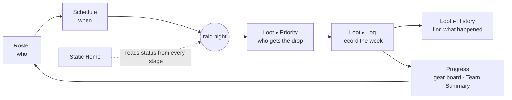

# Systems Flow Map (Phase-D design input)

**Status: RULED — flow-map user walkthrough completed 2026-07-26.** Built to satisfy the mandate
recorded in `v1-v2-parity-matrix.md` §9 (user checkpoint 2026-07-26): *"there's a lot of major
systems competing for placement inside the app; I just want to make sure the flow between these
systems are intuitive and have a clear flow map."* **11 of 12 decision points ruled; F-04 (Split
Planner entry) deliberately deferred into Phase-D design** with candidates on record. This
document is now a **binding Phase-D design input**: it closed parity units D-67/D-68, triggered
delta R2 (Progress = 5th Spine tab), and fixed the homes of every system the rulings left "TBD."

Grounded in: `docs/PRODUCT_MODEL.md` (layers §3.1 · spine §3.2 · Progress Engine §3.3 · rings
§3.4 · the §4 triage questions), the ruled parity matrix (66 rulings + 2 deferred), and the
user's dashboard-direction statement (2026-07-26, quoted in §1). Director plan-vet completed
2026-07-26 (GAPS-FOUND → all findings folded into this revision).

---

## 1. The two concepts: Home vs Dashboard

The root cause of the "competing dashboards" confusion is that the app never separated these:

| Concept | Definition | Audience | Density |
|---|---|---|---|
| **Home** | Where you land. Orienting, shared, points you at what you came to do. | Everyone in the context | Low–medium |
| **Dashboard** | An instrument for operating something. Status-heavy, action-dense. | Whoever operates the thing | High |

User direction (2026-07-26, verbatim): *"It feels like we need to seperate [sic] the concept of
a Dashboard from a Home page. The player hub feels like a Player's Dashboard. I think normally
these are accessed via the user menu and not directly from the app which keeps it seperate [sic]
from the main function of the app. Same with statics — a lot of the Home view inside a static view is
more of a Dashboard for raid leads/owners… and a more home/overview tab/page … becomes more of an
informational hub/convenience for everyone in the static as a whole."*

Applied to the three offending surfaces:

| Surface | Identity under this map | Consequence |
|---|---|---|
| **Player Hub** | *The player's dashboard* (Person layer) | Moves behind the **user/avatar menu**; loses its rail slot (⏳ F-01) |
| **Static Home** | *The static's shared informational hub* (the weekly loop, readable by every role) | Stays the first Spine tab; lead signals appear as a **role-adaptive section**, not a separate page (⏳ F-09) |
| ~~A third "Lead Dashboard" page~~ | **Not created** unless lead-only content outgrows Home | Guards against re-creating the two-dashboard problem one level down |

### 1.1 Declared model deltas (deliberate, per `RECONCILIATION.md` — the model wins or is changed deliberately)

| # | Delta | What it supersedes |
|---|---|---|
| **R1** | Player Hub's everyday access moves to the **user menu**; its "personal front door" role survives only as the landing target for static-less users (rule L-2). | `PRODUCT_MODEL.md` §5 "becomes the personal front door" — refined, not reversed |
| **R2** *(conditional on F-03)* | If F-03 rules **Progress as a 5th Spine tab**, that supersedes `REDESIGN_SPEC.md` §3.2 ("The spine: four tabs, not five") and amends RECONCILIATION item B7 (which defines completion against a four-tab spine). | REDESIGN_SPEC §3.2 · RECONCILIATION B7 |
| **R3** | `PRODUCT_MODEL.md` §5's label for the static Home — "weekly-loop **dashboard**" — is retired in favour of "shared informational **hub**". Same modules, same weekly-loop content; the word changes because §1 now reserves *dashboard* for operator instruments and distinguishes surfaces by **audience**. | PRODUCT_MODEL §5 wording |

**Write-back action item:** when the F-items are ruled, amend `PRODUCT_MODEL.md` §5 (Player Hub
row, Static Home row), `REDESIGN_SPEC.md` §3.2 (if R2 triggers), and `RECONCILIATION.md` in the
same PR — the constitution gets amended on ruling, never drifts.

---

## 2. Proposed navigation skeleton

```
GLOBAL RAIL (Person-layer context switcher — statics only)
├── [static pin] ×N        → that static's Home
├── 🌐 Static Finder        → discovery / matching (Ring 1)
└── (rail Home icon REMOVED — its target moves to the user menu)

TOP BAR · USER/AVATAR MENU (Person layer — additions to the EXISTING menu, not a rebuild; see §2.2)
├── Player Hub              → personal dashboard (Overview · Sync & Gear · Jobs & Gear ·
│                             Tracking · Availability · Share · My Statics)
├── (existing items keep their places: Docs submenu, notifications, theme, anonymity, sign out)
└── Switch UI (v2 ⇄ classic) — already here on desktop; mobile path is a §5 precondition

IN-STATIC SPINE (the weekly loop, ≤2 levels deep)
├── Home        — shared informational hub (§4 modules)
├── Roster      — Cards ⇄ Board (+ Characters modal)          [Phase C rebuilds the card]
├── Loot        — Priority (Queues ⇄ Matrix) · Log · History  (⏳ F-06 — the D-30 grid's home)
├── Schedule    — sessions + availability heatmap + best times
└── Progress    — the tracks surface (Goals/Farms/…)          (✅ F-03 ruled: 5th tab — delta R2 active)

SETTINGS (gear icon, role-scoped slide-out) — configures, never duplicates, the job pages
```

### 2.1 Landing rules (⏳ F-02)

| # | State | Lands on |
|---|---|---|
| L-1 | Deep link / invite / share code | The linked surface (always wins) |
| L-2 | Signed in, **no statics** | **Player Hub** (its front-door role survives for exactly this case) |
| L-3 | Signed in, ≥1 static | **Last-visited static's Home** |

The root route `/` becomes the **landing dispatcher** that applies L-1…L-3 (it stops being a
destination of its own). "Create a static" must remain reachable from the L-2 landing and from
the rail (e.g. a "+" slot) — it cannot be buried three levels into the user menu.

### 2.2 Shared-surface exceptions — where "v2-only" is NOT automatic

Three of this map's proposals land in components **both shells render**. Each carries the rule:
*v2-only mount point, or an explicit user-approved V1 delta — never a silent edit to legacy.*

| Proposal | Shared component | Legacy mount | Handling |
|---|---|---|---|
| Danger Zone → Settings ▸ Static (§5) | `StaticSettingsHost` (settings panel is pure reuse) | `GroupView.tsx:99-101` | Adding Leave/Delete to Settings is a **V1-visible change** — needs its own decision inside F-12 |
| Lodestone flow → Characters path (D-12 redesign) | `RosterCharacterPanel` | `GroupViewContent.tsx:948` | Adding the search→sync flow there also surfaces in V1 — Phase-D design must pick a v2-only mount or declare the V1 delta |
| User-menu changes (F-01) | `UserMenu` (rendered by legacy `Header` on mobile) | `Header.tsx:70,412` | F-01's *addition* is nothing (the Player Hub item already exists in the menu); the change is **removing the v2 rail icon** — genuinely v2-only (`AppChrome.tsx:116-137`). Any menu restructuring beyond that touches V1 |

---

## 3. System registry — the identity paperwork

Every major system answers PRODUCT_MODEL §4's **three** questions — *which layer · which
ring/track · **woven or parked*** — plus its owning surface and entry point. ("Prefer woven. A
feature that can only be a standalone tab is a yellow flag" — `PRODUCT_MODEL.md` §4. The two
parked entries below are therefore flagged, not hidden.)

| System | Layer | Ring / track | Woven / parked | Owning surface | Entry point(s) | Notes |
|---|---|---|---|---|---|---|
| **Player Hub** (Overview, Sync & Gear, Jobs & Gear, Tracking, Availability, Share, My Statics) | Person | — (the Person layer itself) | Parked (deliberately — it's the Person layer's one surface) | Player Hub page | User menu (⏳ F-01); landing L-2 | The player's dashboard. Personal availability/characters feed statics per §3.1 |
| **Static Finder** | Person↔Static | Ring 1 (recruitment-as-matching) | Parked (own page) | Finder page | Rail globe | Applicant side; the static side lives in Settings ▸ Recruitment |
| **Static Home** | Static | Ring 0 readout | Woven (reads the loop) | Home tab | Spine · landing L-3 | Shared hub: hero/next session, this-week loot, readiness, objectives (D-66), member interest (D-70), activity (D-63 backend feed), role-adaptive attention section (⏳ F-09) |
| **Roster** | Static | Ring 0 | Woven (spine) | Roster tab | Spine | Phase C: restored expanded⇄compact card (D-01…D-10) |
| **Loot — Priority** | Static | Ring 0 | Woven (spine) | Loot ▸ Priority | Spine | Queues ⇄ Matrix is an **in-view control**, not a nav level (D-23 ruling); weapon priority placement per D-27 redesign |
| **Loot — Log (weekly grid)** | Static | Ring 0 | Woven (spine) | **Loot ▸ Log (✅ F-06 ruled — the Priority · Log · History triad stands)** | Spine | D-30 ruling: the grid is a *logging* surface — record the week |
| **Loot — History** | Static | Ring 0 | Woven (spine) | Loot ▸ History | Spine | D-31/D-72 ruling: ONE find-it table (v1 All-Weeks + search merged with v2 pills) |
| **Books ledger** | Static | Ring 0 | Woven | **Loot ▸ Log (✅ F-07 ruled)** | via Loot | D-38 ruling closed: books live with the recording surface; balances also readable in Team Summary |
| **Team Summary** | Static | Ring 0 readout | Woven | **Home module (✅ F-08 ruled)** | Home | D-42 restore; D-43 placement closed; consolidates D-59/D-62/D-64 |
| **Team Gear-Sync dashboard** (sync health, role coverage, stale members — KEPT rows P-2…P-7) | Static | Ring 0 readout | Woven | **Roster area (✅ F-05 ruled)** | via Roster | D-43's safety net preserved — the dashboard moves from PluginPage into the Roster area |
| **Schedule + availability** | Static (avail = Person input) | Ring 0 clock / Ring 1 depth | Woven (spine) | Schedule tab | Spine | Availability edits write Person data, aggregate to the static heatmap (§3.1 rule) |
| **Past-sessions / attendance view** | Static | Ring 1 | Woven | Schedule (future view) | via Schedule | **New build**, not a re-home — v2 Schedule has no past-sessions path today (§5 Session-History row) |
| **Goals & Farms (tracks)** | Static (ownership data = Person) | Ring 3 tracks on the Progress Engine | **Parked — declared trade, delta R2 (✅ F-03 ruled)** | **Progress tab (5th Spine entry)** | Spine | PRODUCT_MODEL §5: "Tracking folds into the Progress Engine tracks surface". Scope note: the orphaned `components/mount-farms/**` tree (matrix §12-A9, incl. per-member bulk edit with no live equivalent) is resolved by this row — revive into the tracks surface or delete |
| **Split Planner** | Static | Ring 3 (alts / funneling) | ⏳ F-04 | ⏳ F-04 | ⏳ F-04 | D-18 restored the surface; its "from More" entry died with D-52 |
| **Settings panel** | Static (role-scoped) | — (configuration) | Woven (slide-out over any page) | Slide-out | Gear icon | Pure reuse both shells (**shared surface — §2.2**); Recruitment/Integrations/Members/Priority/Goals config live here |
| **Dalamud Plugin (setup + guide)** | **Person (✅ F-05 ruled)** | Cross-cutting integration | Woven (setup lives in Hub/docs) | **Player Hub ▸ Sync & Gear (setup) + Docs (guide)** | Docs link/banner; NOT a tab (D-52) | PRODUCT_MODEL §3.5: "it is **setup**, not a daily destination". Statics see sync status only; the team dashboard row above is homed separately (Roster area) |
| **Docs & Help** (10 routes: quick-start, roadmap, release notes, design system, …) | Person/global | Platform | Parked (own routes — appropriate for reference content) | `/docs/**` pages | User-menu Docs submenu | Becomes the Plugin guide's owning surface if F-05 rules docs-homed |
| **`/dashboard` "My Statics"** | Person | — | **Duplicate surface** | Player Hub ▸ My Statics | (today: standalone route) | Same `MyStaticsPanel` mounted twice — exactly the class this map closes. Proposal: `/dashboard` redirects to the Hub tab; record in F-01 |
| **Root `/` landing + static creation** | Person | — | — | Landing dispatcher (§2.1) + wizard | `/` · rail "+" | `/` stops being a destination; Create-a-static keeps a first-class path (L-2 landing + rail) |
| **Public profile** (`/profile/:shareCode`) | Person | Ring 1 (recruitment adjacency) | Parked (public page — by nature) | Public profile page | Player Hub ▸ Share | The share target; no change proposed |
| **Lodestone sync** | Person data feeding Static | Cross-cutting | Woven | Characters path | Characters modal / Player Hub (D-12 redesign) | **Shared surface — §2.2.** No card-kebab entry returns |
| **Notifications** | Person | Platform | Woven (bell) | Bell | Top bar | |
| **⌘K palette** | Both | Platform (power layer) | Woven | — | Keyboard | Never the *only* path to anything (D-52 lesson) |
| **Admin area** | Platform ops | Platform | Parked (deliberately separate) | /admin | Admin-only | Not part of the static product (model §5) |

### 3.1 Duplicate-component register (PRODUCT_MODEL §5: "one owned component per task")

The model names these duplications; the flow map records who owns each after Phase D:

| Task | Instance A | Instance B | Owner after Phase D |
|---|---|---|---|
| Catalog browser | Player Hub ▸ Tracking "Browse Catalog" | Static CollectionsHub browser | ⏳ rides on F-03 — one shared browser component, mounted by both layers |
| Availability editor | Player Hub ▸ Availability (`PlayerAvailabilityTab`) | Static Schedule `AvailabilityGrid` modal | One shared editor; Person page edits the source data, static modal edits the same store scoped to the week (§3.1 rule makes them the same data — enforce one component) |
| Recipient picker | v2 `RecipientPicker` | (legacy modal family — sunsets with V1) | `RecipientPicker` (already consolidated in v2) |

---

## 4. The flows

### 4.1 The weekly loop across surfaces (Ring 0)



Home never *operates* the loop — it reads it. Priority decides, Log records, History finds:
three verbs, three views (the D-30/D-31 split made formal).

### 4.2 Cross-system flows (the seams the rulings created)

| From | To | Mechanism | Source ruling |
|---|---|---|---|
| Player Hub ▸ Availability | Every static's heatmap | Person input aggregates up (§3.1) | model |
| Roster card gear slot | **Loot ▸ Log cell** (current week) / **History row** (past weeks) / Books row | Alt+Click, right-click jump, kebab | D-05 restore — post-split destinations |
| Loot ▸ History row | Roster player | "Jump to {player}" kebab item | D-34 |
| Home attention row | Settings ▸ Recruitment ▸ Requests | "Review" button | D-61/D-69 keep-v2 |
| Tracks surface (farm) | Schedule (pre-filled session) | `MOUNT_FARM_SCHEDULE` event bus | D-65 redesign — handoff moves to the Goals/tracks page, **not** Home |
| Plugin | Gear board / loot log / mounts | API (feeds Ring 0 + Ring 3) | model §3.5 |
| Lodestone | Gear board | Characters-path sync flow | D-12 redesign |
| Deep links (`?player=`, `?entry=`, `?sessionId=`) | Any surface | Shift+Click / right-click copy (superuser affordance) | D-55 redesign |

---

## 5. More-page dissolution map (executing D-52)

D-52 ruling: *the More tab is dropped; anything useful gets a better home.* PRODUCT_MODEL §5
already demanded this ("Junk drawer — **Delete it.**"). Per-card disposition — confirm as ⏳ F-12:

| More-page card | New home | Status |
|---|---|---|
| Requests | Settings ▸ Recruitment ▸ Requests + Home attention row | Already exists — card deletes clean |
| Lead Tools (settings/permissions shortcuts) | Settings (Members/Permissions tabs) | Already exists — card deletes clean |
| Loot History | Loot ▸ History | Already exists — card deletes clean |
| Split Planner | ⏳ F-04 | Blocked on F-04 |
| Integrations | Settings ▸ Integrations | Already exists — card deletes clean |
| Dalamud Plugin | Docs guide + setup per ⏳ F-05 (which must also home the Team Gear-Sync dashboard) | Blocked on F-05 |
| Settings | Gear icon | Already exists — card deletes clean |
| Exports *(Coming soon stub)* | **Static-data** exports → Settings ▸ Static (data section) when built. (*Person* account-data export/delete is a different item — Plan M, Person settings, per model §5) | Stub — delete card, note in backlog |
| Activity Log *(Coming soon stub)* | Home activity "view all" (D-63 restored the backend feed) | Natural home — stub deletes |
| Session History | Already exists **as a Schedule link** (the card just navigates there today). The promised *past-sessions/attendance view* is **new build**, tracked as its own registry row | Confirm in F-12 |
| New UI switcher | User menu (item already exists on desktop v2). **Mobile precondition:** today the More card is the **only** mobile v2→legacy path (V2M-11; the rail is desktop-only) — a mobile-reachable switcher must ship before the card dies | Confirm in F-12 |
| Danger Zone (Leave/Delete) | Settings ▸ Static (danger section) — **shared-surface exception §2.2, ✅ user-approved as an explicit V1-visible delta (F-12)**: also fixes V1's dead Danger-Zone finding. D-50 View-As suppression rides along | ✅ Ruled |

---

## 6. Decision points for the walkthrough (⏳ F-01…F-12)

| ID | Question | Lean (rationale) |
|---|---|---|
| **F-01** | Player Hub moves behind the user menu; rail = statics + Finder only? (Includes: `/dashboard` redirects to Hub ▸ My Statics) | ✅ **RULED YES (2026-07-26).** User direction; kills the two-Home-buttons confusion. Menu item already exists; the build is *removing* the rail icon (v2-only, §2.2) |
| **F-02** | Landing rules L-1/L-2/L-3 + `/` as dispatcher + first-class Create-a-static path, as tabled in §2.1? | ✅ **RULED YES (2026-07-26).** Preserves the Hub's front-door role for static-less users only |
| **F-03** | Does the tracks surface (Goals/Farms) get a Spine entry — **Progress** as the 5th tab (a **parked** surface; triggers delta R2) — or does **Settings ▸ Goals & Farms become the owning surface with the standalone GoalsPage dissolved**? | ✅ **RULED: PROGRESS 5TH SPINE TAB (2026-07-26)** — delta R2 triggers; `REDESIGN_SPEC.md` §3.2 and RECONCILIATION B7 get amended in the §1.1 write-back. Rationale held: the model's spine literally ends in Progress (§3.2); tracks get their one home; era-2 demand was real (goals 69/22) |
| **F-04** | Split Planner's entry point? *(F-03-dependent)* | ⏸ **DEFERRED (2026-07-26) to Phase-D design.** Candidates on record: inside the Progress tab (split clears are Ring-3 alt-progression — the F-03 ruling makes this available) or reached from Roster (it plans rosters for splits) |
| **F-05** | Plugin: static-level or player-level? **The ruling must name TWO homes: (a) the setup/guide, (b) the Team Gear-Sync dashboard (KEPT P-2…P-7) — D-43's ruling assumes (b) survives** | ✅ **RULED (2026-07-26): (a) player-level setup** — Player Hub ▸ Sync & Gear + guide in Docs; statics see sync status only; **(b) the Team Gear-Sync dashboard lives in the Roster area** (roster-shaped Ring-0 readout) |
| **F-06** | The weekly grid (Loot ▸ Log as a third view: Priority · Log · History)? | ✅ **RULED YES (2026-07-26).** Decide / record / find — the Loot triad is the structure |
| **F-07** | Books ledger placement? | ✅ **RULED: INSIDE LOOT ▸ LOG (2026-07-26).** Recording books is part of recording the week; balances also readable in Team Summary |
| **F-08** | Team Summary home? | ✅ **RULED: HOME MODULE (2026-07-26).** The shared per-player readout lands on static Home — closes D-43's placement (matrix D-43 lean confirmed) |
| **F-09** | Lead signals = role-adaptive section inside Home (no separate Lead Dashboard page)? | ✅ **RULED YES (2026-07-26).** Revisit only if lead-only content demonstrably outgrows the page |
| **F-10** | D-67 (deferred): Active-Farms display on Home? *(F-03-dependent)* | ✅ **RULED: ONE TRACKCARD POINTER (2026-07-26).** Home carries one evolved TrackCard linking into the Progress tab; the full farm list lives there. **Closes matrix D-67**; the O-39 empty-state copy returns button-less on the card's empty form |
| **F-11** | D-68 (deferred): Split-Clears readiness card on Home? | ✅ **RULED: ATTENTION ROW (2026-07-26).** Data-gated row in the role-adaptive attention section, linking to the Split Planner wherever F-04's deferral lands it. **Closes matrix D-68** |
| **F-12** | More-page dissolution table (§5) — confirm: Session-History row (link now, view later), the mobile-switcher precondition, and the **Danger-Zone shared-surface call** (§2.2: Leave/Delete land in the shared settings panel = V1-visible, or get a v2-only mount)? | ✅ **RULED: CONFIRM ALL (2026-07-26).** Dissolution as tabled; **Danger-Zone-in-Settings approved as an explicit V1-visible delta** (also fixes V1's dead Danger-Zone finding from the holistic review); mobile switcher remains hard-blocking for the More page's deletion |

---

## 7. What this does NOT change

- **Phase C scope** — the roster-card rebuild (D-01…D-19 rulings) is independent of every F-item.
- **The Spine's ≤2-level rule** — the Loot triad is level 2, and Queues ⇄ Matrix inside Priority
  is an **in-view control, not a nav level** (the form the user ruled in D-23); the budget is
  intact *by design*, not by accident. R2 (tab count) is the one nav-structure delta, and it is
  declared, conditional, and user-ruled.
- **Settings configure-don't-duplicate** (PRODUCT_MODEL §5) — unchanged; F-03's alternative form
  would make Settings ▸ Goals & Farms an *owner*, which is the one deliberate exception if ruled.
- **V1 stays bugfix-frozen** — with the three **declared shared-surface exceptions in §2.2**
  (settings panel, characters panel, user menu), each requiring a v2-only mount or an explicit
  user-approved V1 delta. Nothing else in this map touches legacy.
- The ex-D-56 mobile rider still applies: every restored desktop control ships with a
  phone-width equivalent, and §5's mobile-switcher precondition is hard-blocking for the More
  page's deletion.
